# LAPORAN PROYEK MACHINE LEARNING: Sistem Rekomendasi Buku Menggunakan Content-Based dan Collaborative Filtering

---


## **Project Overview**

Minat baca masyarakat Indonesia masih menjadi tantangan besar. Berdasarkan laporan UNESCO, minat baca masyarakat Indonesia sangat memprihatinkan, yakni hanya 0,001%, yang berarti dari setiap 1.000 orang hanya 1 orang yang aktif membaca (UNESCO, 2016 dalam ResearchGate). Kondisi ini turut diperparah dengan keterbatasan akses terhadap bahan bacaan yang sesuai dengan minat individu, sehingga banyak orang kesulitan menemukan buku yang benar-benar menarik untuk dibaca.
Di era digital saat ini, sistem rekomendasi telah menjadi alat penting dalam membantu pengguna menemukan konten yang relevan dengan preferensi mereka. Salah satu contoh sukses adalah Amazon, yang menggunakan sistem rekomendasi berbasis machine learning untuk menyarankan produk, termasuk buku, kepada pengguna. Dengan mengandalkan data historis dan pola perilaku pengguna, algoritma tersebut terbukti meningkatkan kepuasan pelanggan dan engagement platform secara signifikan (Amazon Science, 2018).
Melalui proyek ini, penulis mengembangkan sebuah sistem rekomendasi buku berbasis machine learning menggunakan dua pendekatan utama: Content-Based Filtering dan Collaborative Filtering. Content-Based Filtering merekomendasikan buku yang mirip dengan buku yang disukai pengguna sebelumnya berdasarkan fitur konten seperti judul dan penulis, sementara Collaborative Filtering menyarankan buku berdasarkan pola perilaku pengguna lain yang memiliki preferensi serupa.
Diharapkan, sistem ini dapat membantu pembaca menemukan buku yang sesuai dengan minat mereka, sehingga pada akhirnya dapat meningkatkan budaya literasi di Indonesia melalui pendekatan teknologi yang lebih cerdas dan personal.

---

## **Business Understanding**

fokus utama adalah mengidentifikasi permasalahan yang ingin diselesaikan melalui proyek sistem rekomendasi buku ini. Dengan pemahaman yang jelas terhadap masalah yang dihadapi, kita dapat merumuskan tujuan yang tepat agar solusi yang dikembangkan efektif dan relevan. Berikut adalah pernyataan masalah dan tujuan proyek yang akan menjadi landasan pengembangan sistem rekomendasi ini.
Dengan adanya sistem prediktif berbasis machine learning, diharapkan:

**Problem Statements**

- Masalah 1: Pembaca sering kesulitan menemukan buku yang sesuai dengan preferensi dan minat mereka karena banyaknya pilihan yang tersedia tanpa panduan yang jelas.

- Masalah 2: Kurangnya sistem rekomendasi yang mampu memberikan saran buku yang personal dan relevan berdasarkan data rating dan konten buku.

- Masalah 3: Pengguna sering kali merasa bingung memilih buku baru yang berkualitas dan sesuai kebutuhan bacaan mereka, sehingga mengurangi minat baca secara keseluruhan.

**Goals**

- Tujuan 1: Membangun sistem rekomendasi buku yang dapat membantu pembaca menemukan buku yang sesuai dengan minat mereka.

- Tujuan 2: Menerapkan dua pendekatan sistem rekomendasi utama, yaitu Content-Based Filtering dan Collaborative Filtering, untuk memberikan rekomendasi buku yang relevan dan beragam.

- Tujuan 3: Meningkatkan pengalaman pengguna dalam mencari buku baru dengan rekomendasi yang didasarkan pada rating pengguna lain dan kemiripan konten buku, sehingga dapat mendukung peningkatan budaya literasi.

**Solution Statements**

Dalam proyek ini menggunakan dua pendekatan sistem rekomendasi sebagai solusi untuk mencapai tujuan di atas:

- Content-Based Filtering
  Sistem ini merekomendasikan buku kepada pengguna berdasarkan kesamaan fitur konten buku, seperti judul, terbitan, dan penulis, dengan buku yang sebelumnya telah disukai atau dirating tinggi oleh pengguna tersebut. Pendekatan ini efektif untuk memberikan rekomendasi yang personal tanpa bergantung pada data pengguna lain secara langsung.

- Collaborative Filtering
  Pendekatan ini menggunakan pola rating dan interaksi dari banyak pengguna untuk menemukan kesamaan preferensi antar pengguna. Dengan demikian, buku yang disukai oleh pengguna lain yang memiliki taste serupa akan direkomendasikan. Collaborative Filtering dapat memberikan rekomendasi yang beragam dan dapat mengenalkan buku yang belum pernah dibaca pengguna sebelumnya.

Kombinasi kedua pendekatan ini diharapkan dapat menghasilkan sistem rekomendasi yang lebih akurat, personal, dan variatif, sekaligus mengatasi keterbatasan masing-masing metode secara individual.

---

## **Data Understanding**

| Jenis          | Keterangan                                                               |
| -------------- | ------------------------------------------------------------------------ |
| **Title**      | Book Recommendation Dataset                                              |
| **Source**     | https://www.kaggle.com/datasets/arashnic/book-recommendation-dataset     |
| **Owner**      | Arash Nic                                                                |
| **License**    | CC0: Public Domain                                                       |
| **Visibility** | Public                                                                   |
| **Tags**       | Online Communities, Literature, Art, Recommender Systems, Culture, Human |
| **Usability**  | 10                                                                       |

## **Eksplorasi Data Awal (EDA) dan Deskripsi Variabel**

Dataset ini di dapatkan dari kaggle dengan user name Arash Nic, dalam dataset tersebut terdapat 3 file csv yang bisa digunakan, namun disini saya hanya menggunakan dua dataset saja yaitu Books.csv dan Ratings.csv, saya tidak menggunakan User.csv karena penggunaan Users.csv tidak memberikan kontribusi signifikan terhadap tujuan utama proyek ini, yaitu membangun sistem rekomendasi berbasis interaksi pengguna dan buku bukan demografi, sedangkan pada data User.csv memberikan informasi mengenai demografi pengguna. Oleh karena itu, file tersebut tidak disertakan dalam proyek ini

---

**Datast Books.csv**
| Nama Kolom | Tipe Data | Deskripsi |
|-----------------------|-----------|---------------------------------------------------------------------------|
| ISBN | object | Kode unik internasional untuk setiap buku. Digunakan sebagai identifier. |
| Book-Title | object | Judul buku. Digunakan sebagai fitur dalam Content-Based Filtering. |
| Book-Author | object | Nama penulis buku. Salah satu fitur penting untuk mengetahui kemiripan. |
| Year-Of-Publication | object | Tahun terbit buku. Bisa digunakan sebagai informasi tambahan. |
| Publisher | object | Nama penerbit buku. Kadang digunakan sebagai fitur konten tambahan. |
| Image-URL-S | object | URL gambar buku ukuran kecil (small). Tidak digunakan dalam modeling. |
| Image-URL-M | object | URL gambar buku ukuran sedang (medium). Tidak digunakan dalam modeling. |
| Image-URL-L | object | URL gambar buku ukuran besar (large). Tidak digunakan dalam modeling. |

**Insight Awal Books.csv**

- Dataset ini berisi informasi bibliografi dari berbagai buku, seperti judul, penulis, penerbit, dan tahun terbit.

- Tidak terdapat missing value yang signifikan, namun terdapat beberapa entri dengan nilai yang tidak valid, seperti tahun terbit "0" atau "9999".

- Fitur ISBN dapat digunakan sebagai identitas unik buku, sementara Book-Title, Book-Author, dan Publisher dapat dikombinasikan sebagai fitur konten dalam pendekatan Content-Based Filtering.

- Kolom gambar (Image-URL-S/M/L) tidak digunakan dalam proyek karena tidak relevan terhadap konteks sistem rekomendasi berbasis teks dan interaksi pengguna.

**Dataset Ratings.csv**
| Nama Kolom | Tipe Data | Deskripsi |
|--------------|-----------|----------------------------------------------------------------------------|
| User-ID | int64 | ID pengguna yang memberikan rating. Digunakan pada Collaborative Filtering.|
| ISBN | object | ID buku yang dirating. Digunakan untuk menghubungkan ke data Books.csv. |
| Book-Rating | int64 | Nilai rating yang diberikan pengguna terhadap buku, skala 0–10. |

**Insight Awal Ratings.csv**

- Dataset ini berisi informasi rating dari pengguna terhadap buku tertentu dengan skala 0 hingga 10.

- Seluruh fitur memiliki tipe data numerik atau kategorikal sederhana yang mudah diproses untuk modeling.

- Terdapat ketimpangan distribusi pada data rating, dengan sebagian besar rating berada pada nilai 0 yang diasumsikan sebagai implicit feedback.

- User-ID dan ISBN membentuk relasi antara pengguna dan buku, dan digunakan sebagai input utama dalam pendekatan Collaborative Filtering.

- Banyak pengguna hanya memberikan sedikit rating, sehingga perlu dilakukan filtering untuk menjaga kualitas dan efektivitas model.

| Dataset | Jumlah Baris | Jumlah Kolom |
| ------- | ------------ | ------------ |
| Books   | 271,360      | 8            |
| Ratings | 1,149,780    | 3            |

Terdapat beberapa missing value pada dataset dengan rincian seperti berikut


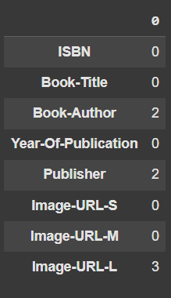

Books


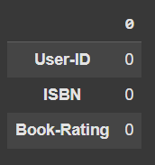

Ratings

Tidak ada data duplikat pada kedua dataset ini

---

## **Eksplorasi Data Lanjutan (EDA) Univariate**

**Distribusi Tahun Terbit**
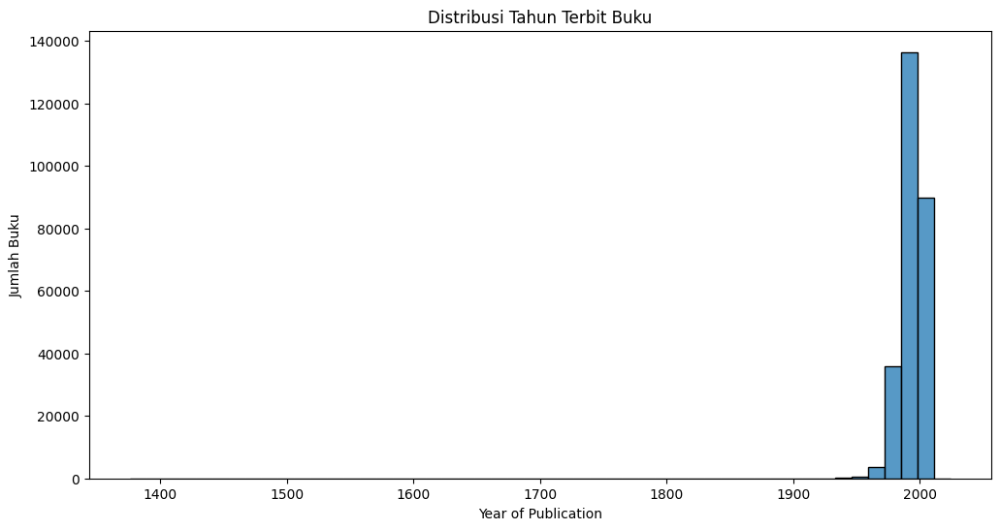
melakukan pengecekan distribusi tahun terbit buku, paling banyak buku di terbitkan pada rentang waktu 1950 hingga 2010

**Top 10 Penulis dengan Buku Terbanyak**
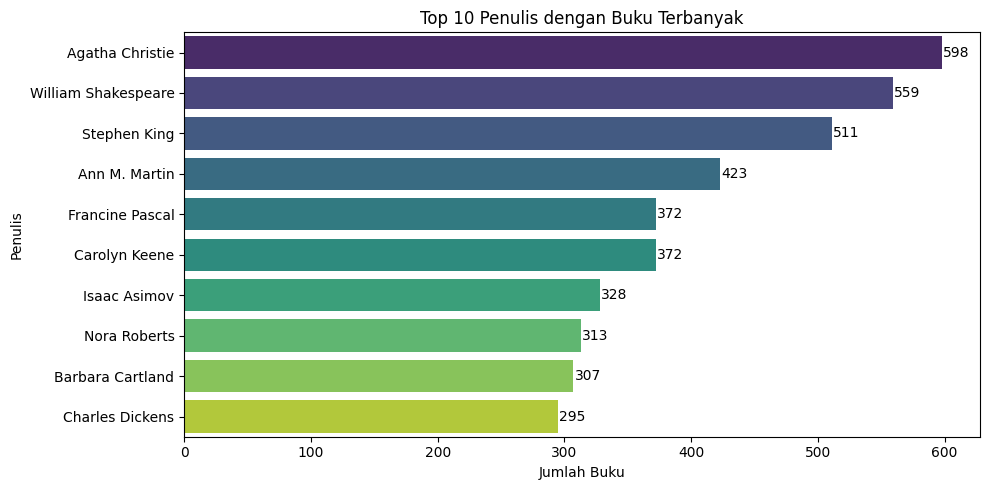
agtatha christie merupakan penulis buku terbanyak dengan nilai 598 buku

**Top 10 Publisher dengan Buku Terbanyak**
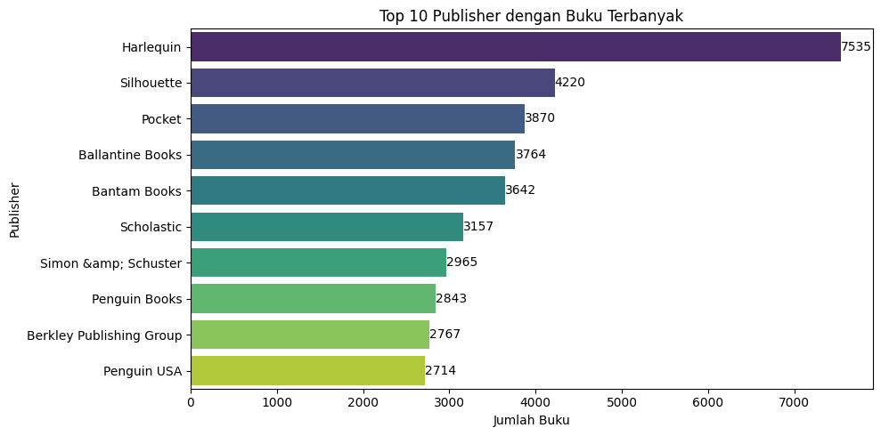
harlequin menjadi penyumbang buku terbanyak dengan mempublikasi 7535 buku

**Distribusi Rating Buku**
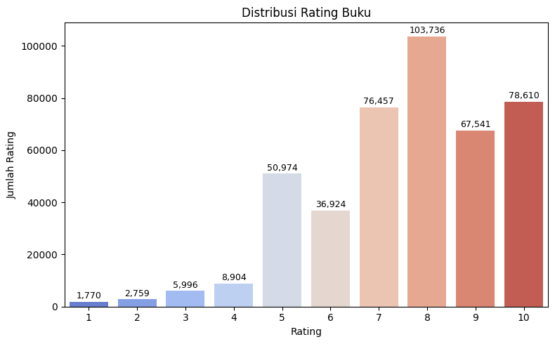
buku ternbanyak di rating dengan jumlah 8 rating sebanyak 103,736 ini menunjukkan bahwa pengguna lebih banyak melakukan rating 8

---

## **Eksplorasi Data Lanjutan (EDA) Multivariate**

**Rata-Rata Rating Penulis (Top 10 berdasarkan jumlah rating)**
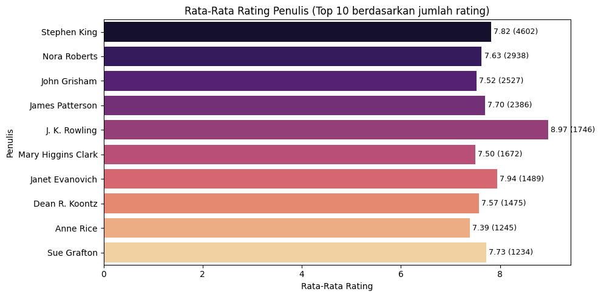
J.k Rowling mendapatkan rata rata penulis buku berdasarkan jumlah rating terbanyak, rata ratanya 8.97 dengan nilai asli 1746

---

## **Data Preparation**

Pada tahap ini, dilakukan beberapa langkah penting untuk membersihkan dan mempersiapkan data agar siap digunakan dalam proses pemodelan sistem rekomendasi.

**1.Penghapusan Kolom yang Tidak Digunakan**
Kolom `Image-URL-S`, `Image-URL-M`, dan `Image-URL-L` dihapus dari dataset Books.csv karena proyek ini hanya berfokus pada rekomendasi berbasis deskriptif buku (judul, penulis, dll) dan interaksi pengguna, tanpa menggunakan data gambar. Penghapusan kolom-kolom ini bertujuan untuk mempermudah pemrosesan data dan mengurangi beban komputasi.

**2. Konversi Tahun Terbit ke Numerik dan Penanganan Nilai Error**
Kolom `Year-Of-Publication` awalnya bertipe objek, sehingga dikonversi ke tipe numerik menggunakan `pd.to_numeric` dengan parameter `errors='coerce'.` Nilai yang tidak dapat dikonversi otomatis diubah menjadi NaN. dan diubah ke tipe data integer nullable (Int64) agar lebih efisien dan konsisten dengan data numerik yang sudah dibersihkan. Hal ini penting agar data tahun terbit dapat digunakan dalam analisis dan pemodelan secara numerik.

**3. Penyaringan Tahun Terbit yang Valid**
Data tahun terbit difilter untuk hanya menyertakan buku yang diterbitkan antara tahun 1000 hingga 2025. Batasan ini dipilih untuk menghilangkan data yang tidak masuk akal atau kesalahan pencatatan seperti nilai 0, 9999, atau tahun yang terlalu ekstrim. Setelah proses filter, dataset berkurang dari 271.360 menjadi 266.727 baris, sehingga ada 3.570 data yang dihapus karena nilai tahun terbit tidak valid, proses ini juga bagian dari handling outlier yang ditakutkan sangat banyak

Setelah melakukan pembersihan dan konversi tipe data pada dataset books_df, dilakukan pengecekan missing value untuk memastikan tidak ada data yang kosong yang dapat mengganggu proses pemodelan.

**4. Pengecekan Missing Value**
Dengan menggunakan metode `.isnull().sum()`, ditemukan bahwa dataset books_df masih memiliki missing value pada kolom:

`Book-Author` sebanyak 2 baris

`Publisher` sebanyak 2 baris

Sedangkan pada dataset ratings_df, tidak ditemukan missing value pada ketiga kolom `(User-ID, ISBN, Book-Rating)`.
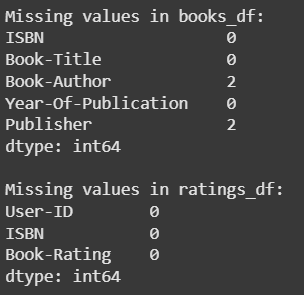

**5. Penanganan Missing Value**
Karena jumlah missing value pada books_df sangat kecil (hanya 2 baris untuk masing-masing kolom), maka langkah yang diambil adalah menghapus baris-baris yang mengandung nilai kosong tersebut menggunakan fungsi .`dropna(subset=['Book-Author', 'Publisher']).`

Pendekatan ini dilakukan untuk menjaga konsistensi dan keakuratan data tanpa menimbulkan bias dari imputasi yang kurang relevan, mengingat jumlah data yang hilang sangat sedikit dibandingkan ukuran dataset keseluruhan.

**6. Filtering Ratings**
Pada dataset ratings_df, dilakukan penyaringan data dengan hanya mempertahankan baris-baris yang memiliki nilai rating lebih besar dari 0.

- Alasan Filter Rating > 0
  Nilai rating 0 biasanya menandakan bahwa pengguna tidak memberikan penilaian atau rating tersebut adalah placeholder. Oleh karena itu, baris dengan rating 0 tidak merepresentasikan preferensi pengguna dan bisa mengacaukan hasil rekomendasi.
  Dengan memfilter hanya rating > 0, sistem rekomendasi akan menggunakan data interaksi yang valid dan bermakna, sehingga kualitas model rekomendasi dapat meningkat.

- Hasil Filter
  Dari total 1.149.780 data rating awal:
  -- Sebanyak 716.109 baris data dengan rating 0 dihapus
  -- Data rating yang tersisa adalah 433.671 baris, yang semuanya berisi rating valid > 0

- Shape Dataset Akhir
  Setelah proses pembersihan dan filtering, shape dataset menjadi:

| Dataset    | Jumlah Baris | Jumlah Kolom |
| ---------- | ------------ | ------------ |
| books_df   | 266.723      | 5            |
| ratings_df | 433.671      | 3            |

hasil filter tadi juga sekaligus untuk menghandling outlier yang ditakutkan sangan banyak, sehingga hasil filter tadi adalah:

- Tahun terendah: 1376
- Tahun tertinggi: 2024

Dataset ini lebih bersih dan siap untuk digunakan dalam membangun sistem rekomendasi.

**7. Filtering Lanjutan untuk Efisiensi Komputasi**
Karena ukuran dataset yang cukup besar menyebabkan Google Colab mengalami keterbatasan memori saat proses training Collaborative Filtering, dilakukan proses filtering lanjutan agar data tetap representatif namun lebih ringan dan efisien untuk diproses:

1. Filter Buku Populer

- Dilakukan seleksi hanya terhadap buku yang telah dirating setidaknya 10 kali oleh pengguna.
- Tujuannya untuk menghindari buku-buku yang jarang dirating dan bisa menyebabkan data terlalu _sparsity_ (jarang terisi), sehingga sulit dipelajari oleh model.
- Hasilnya: hanya buku dengan interaksi yang cukup dianggap relevan untuk sistem rekomendasi.

2. Filter Pengguna Aktif

- Setelah buku disaring, dilakukan filter kedua terhadap pengguna.
- Hanya pengguna yang telah memberikan minimal 5 rating yang dipertahankan.
- Hal ini bertujuan untuk memastikan bahwa pengguna yang digunakan dalam training memiliki cukup data untuk memodelkan preferensi mereka secara akurat.

3. Sinkronisasi Dataset Buku

- Setelah filtering ratings_df, dilakukan sinkronisasi ke books_df agar hanya mencakup buku-buku yang masih memiliki interaksi aktif (terfilter).
- Ini memastikan keselarasan antara dataset buku dan rating.

4. Hasil Filtering

| Keterangan                        | Jumlah  |
| --------------------------------- | ------- |
| Jumlah data rating sebelum filter | 433,671 |
| Jumlah data rating setelah filter | 92,449  |
| Jumlah user unik setelah filter   | 6,029   |
| Jumlah buku unik setelah filter   | 5,633   |

Dengan langkah ini, dataset menjadi jauh lebih manageable dan tetap representatif, sehingga proses pelatihan model rekomendasi dapat berjalan dengan lebih cepat dan stabil di Google Colab, tanpa kehilangan kualitas informasi yang signifikan.

**8. Melakukan Splitting**

Langkah ini penting untuk memastikan model dapat dilatih dengan cukup data sekaligus dievaluasi secara adil menggunakan data yang belum pernah dilihat sebelumnya. data ini di split dengan pembagian 80:20

| Jenis Data | Jumlah |
| ---------- | ------ |
| Data Latih | 73,959 |
| Data Uji   | 18,490 |
| **Total**  | 92,449 |

**9. Ekstraksi Fitur untuk Content-Based Filtering**

Untuk membangun sistem rekomendasi berbasis _Content-Based Filtering_, dilakukan beberapa tahap persiapan data sebagai berikut:

1. Sinkronisasi Data Buku
   Hanya buku-buku yang terdapat pada data `train_ratings` yang digunakan, untuk memastikan fitur yang diekstraksi relevan dengan data pelatihan sistem rekomendasi.

2. Penggabungan Fitur Teks
   Fitur-fitur seperti `Book-Title`, `Book-Author`, dan `Publisher` digabungkan menjadi satu kolom baru `combined_features`. Kolom ini digunakan sebagai representasi konten buku yang akan diproses lebih lanjut

3. Ekstraksi TF-IDF (Term Frequency - Inverse Document Frequency)

- Teknik _TF-IDF_ digunakan untuk mengubah teks menjadi representasi numerik yang dapat diproses oleh model.
- Stopwords dalam bahasa Inggris dihilangkan agar model fokus pada kata-kata yang memiliki makna penting.
- Hasil ekstraksi disimpan dalam bentuk _TF-IDF matrix_, di mana setiap baris merepresentasikan buku, dan setiap kolom merepresentasikan kata penting yang diambil dari fitur gabungan.

Langkah ini menjadi fondasi dari pendekatan Content-Based Filtering, karena sistem akan menghitung kemiripan antar buku berdasarkan vektor fitur yang telah ditransformasikan menggunakan TF-IDF.

**10. Perhitungan Kemiripan antar Buku (Cosine similarity)**
Setelah mendapatkan representasi vektor dari setiap buku melalui teknik TF-IDF, langkah selanjutnya adalah menghitung tingkat kemiripan antar buku menggunakan Cosine Similarity.

1. Cosine Similarity:

   - Merupakan metode umum untuk mengukur kemiripan antar dua vektor dalam ruang berdimensi tinggi.
   - Nilai cosine similarity berkisar antara 0 hingga 1:
     - Nilai 1 menunjukkan dua buku sangat mirip (vektor sejajar).
     - Nilai 0 menunjukkan tidak ada kemiripan (vektor tegak lurus).

2. Implementasi:

   - Fungsi `cosine_similarity` dari `sklearn` digunakan untuk menghitung kemiripan antar seluruh pasangan buku dalam `tfidf_matrix`.
   - Hasilnya berupa matriks simetris berukuran _jumlah buku × jumlah buku_ yang menunjukkan tingkat kemiripan antar setiap buku.

3. Penyimpanan ke DataFrame:
   - Hasil cosine similarity disimpan dalam bentuk `DataFrame` dengan index dan kolom yang sesuai dengan posisi buku pada `train_books_df`.
   - Ini memudahkan dalam pencarian buku yang paling mirip berdasarkan indeks buku tertentu saat melakukan proses rekomendasi nantinya.

### **Preparation untuk Collaborative Filtering**

1.  **Mapping ID ke Format Numerik**  
    Untuk keperluan pemodelan, ID pengguna (`User-ID`) dan ID buku (`ISBN`) perlu dikonversi ke format numerik menggunakan teknik encoding. Hal ini diperlukan karena model hanya dapat menerima input numerik, bukan string atau kategori.

2.  **Pembuatan Dictionary Encoding**  
    Dua buah dictionary dibuat untuk memetakan:

- `User-ID` ke indeks numerik (0 hingga jumlah user - 1)
- `ISBN` ke indeks numerik (0 hingga jumlah buku - 1)

Kolom `user` dan `book` baru ditambahkan ke dataset, masing-masing menyimpan hasil pemetaan ID user dan ID buku.

3. **Normalisasi Skor Rating**  
   Skor rating yang awalnya berada pada rentang 1–10 dinormalisasi ke skala 0–1 menggunakan rumus:


Ini bertujuan untuk mempermudah proses pelatihan model neural network dan meningkatkan konvergensi.

4. **Pemisahan Data Latih dan Validasi**  
   Dataset kemudian dibagi menjadi dua bagian:

- Data latih (training): 80% dari total data.
- Data validasi (validation): 20% dari total data.

Hal ini dilakukan agar performa model dapat dievaluasi pada data yang belum pernah dilihat sebelumnya (validation set), guna menghindari overfitting.

---

## **Modelling**

#### **1. Content Based Filtering**

Untuk membangun sistem rekomendasi berbasis konten, digunakan fungsi `recommend_books_content_based_eval` yang bertujuan memberikan daftar buku yang mirip dengan buku tertentu berdasarkan kemiripan fitur teks (judul, penulis, dan penerbit). Model ini bekerja dengan pendekatan TF-IDF dan Cosine Similarity yang sebelumnya telah dihitung.

**Definisi:**  
Content-Based Filtering merekomendasikan item berdasarkan kemiripan konten antar item itu sendiri. Sistem ini menganalisis deskripsi item (judul, pengarang, penerbit) dan memberikan rekomendasi yang mirip dengan item yang disukai pengguna sebelumnya.

**Cara Kerja:**

- Setiap buku direpresentasikan dalam bentuk vektor menggunakan metode TF-IDF (Term Frequency-Inverse Document Frequency).
- Kemiripan antar buku dihitung menggunakan _cosine similarity_, yaitu:


- Semakin tinggi skor cosine similarity, semakin mirip dua buku tersebut.
- Saat pengguna memasukkan satu buku yang disukai, sistem akan mencari buku-buku lain yang kontennya paling mirip berdasarkan skor kemiripan.

Langkah-langkah yang dilakukan dalam fungsi rekomendasi:

1. **Pencarian Buku Target**  
   Fungsi akan mencari judul buku yang dimasukkan pengguna dalam `train_books_df`. Proses pencarian dilakukan dengan mencocokkan judul buku (tanpa memperhatikan kapitalisasi huruf).

2. **Mengambil Skor Kemiripan**  
   Jika judul ditemukan, indeks buku tersebut digunakan untuk mengambil skor kemiripan (cosine similarity) dengan semua buku lainnya dari `cosine_sim_df`.

3. **Menyortir Buku Berdasarkan Kemiripan**  
   Daftar skor kemiripan kemudian diurutkan dari yang paling mirip ke yang paling tidak mirip. Buku itu sendiri akan dilewati (karena tentu memiliki skor kemiripan = 1).

4. **Mengambil Top-N Rekomendasi**  
   Fungsi akan mengambil `top_n` buku yang paling mirip dengan buku input berdasarkan skor kemiripan tersebut.

5. **Mengembalikan Informasi Buku**  
   Rekomendasi akhir berisi informasi buku berupa:
   - **Judul Buku**
   - **Penulis**
   - **Penerbit**
   - **Skor Kemiripan**

**Penggunaan Fungsi**

```python
recommend_books_content_based_eval("The Kitchen God's Wife", top_n=5)
```

ketika pengguna mencari rekomendasi berdasarkan buku **"The Kitchen God's Wife"** karya Amy Tan, sistem mengembalikan daftar 5 buku paling mirip berdasarkan fitur teks (judul, penulis, dan penerbit). Hasilnya ditunjukkan pada tabel berikut:

| No  | Judul Buku                | Penulis | Penerbit                | Skor Kemiripan |
| --- | ------------------------- | ------- | ----------------------- | -------------- |
| 1   | The Kitchen God's Wife    | Amy Tan | Ivy Books               | 0.804881       |
| 2   | The Hundred Secret Senses | Amy Tan | Putnam Pub Group        | 0.584710       |
| 3   | The Bonesetter's Daughter | Amy Tan | Putnam Publishing Group | 0.486882       |
| 4   | Joy Luck Club             | Amy Tan | Putnam Publishing Group | 0.465584       |
| 5   | The Bonesetter's Daughter | Amy Tan | Ballantine Books        | 0.377191       |

Dapat dilihat bahwa sistem berhasil mengenali pola kesamaan konten, di mana seluruh buku yang direkomendasikan merupakan karya dari penulis yang sama (Amy Tan), dan memiliki penerbit yang mirip. Ini menunjukkan bahwa pendekatan Content-Based Filtering bekerja dengan efektif dalam memberikan rekomendasi yang relevan secara deskriptif berdasarkan konten buku yang sudah disukai sebelumnya.

---

#### **2. Modelling menggunakan RecommenderNet**

**Definisi:**  
Collaborative Filtering memberikan rekomendasi berdasarkan interaksi pengguna dengan item (rating). Neural Collaborative Filtering menggunakan pendekatan deep learning untuk memodelkan hubungan kompleks antar pengguna dan item.

**Arsitektur Model:**
Model yang digunakan terdiri dari:

- Embedding layer untuk merepresentasikan pengguna dan item dalam ruang vektor berdimensi rendah.
- Bias term untuk menangkap preferensi global dari pengguna dan item.
- Operasi dot product untuk menggabungkan representasi pengguna dan item.
- Aktivasi sigmoid pada output untuk menormalisasi skor prediksi antara 0–1.

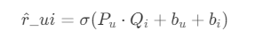

di mana:

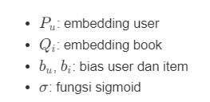

**Training Detail:**

- Optimizer: Adam
- Loss: Binary Crossentropy
- Epoch: 10
- Batch Size: 64
- Metrik Evaluasi: Root Mean Squared Error (RMSE)

Model `RecommenderNet` adalah implementasi neural network untuk sistem rekomendasi berbasis collaborative filtering dengan teknik embedding.
parameter ataupun komponen yang saya pakai

- **Embedding User dan Buku**  
  Model menggunakan embedding layer untuk merepresentasikan user dan buku dalam ruang vektor berdimensi rendah (embedding size 50). Embedding ini memetakan setiap user dan buku ke dalam vektor numerik yang bisa dipelajari selama training, sehingga model dapat menangkap pola preferensi pengguna dan karakteristik buku yang tidak terlihat secara eksplisit.

- **Regularisasi L2**  
  Pada embedding layer diterapkan regularisasi L2 untuk menghindari overfitting. Ini penting agar model tidak terlalu menyesuaikan diri dengan data training saja sehingga performa di data baru tetap baik.

- **Bias User dan Bias Buku**  
  Selain embedding, model juga memiliki embedding khusus untuk bias user dan bias buku. Bias ini berguna untuk menangkap kecenderungan umum dari user (misal user cenderung memberi rating tinggi atau rendah) dan buku (misal buku yang populer cenderung mendapat rating tinggi).

- **Dot Product dan Aktivasi Sigmoid**  
  Model menghitung dot product antara embedding user dan buku sebagai ukuran kesamaan/interaksi keduanya. Kemudian ditambah dengan bias user dan bias buku untuk menyesuaikan prediksi. Output akhir diproses melalui fungsi aktivasi sigmoid, karena target rating sudah dinormalisasi ke rentang 0 sampai 1. Fungsi sigmoid menjamin output prediksi juga berada di rentang tersebut.

- **Kompilasi Model:**  
  Model dikompilasi dengan:
  - **Loss function:** Binary Crossentropy, sesuai dengan output yang dinormalisasi ke 0-1 dan untuk mengukur perbedaan distribusi rating prediksi dan asli.
  - **Optimizer:** Adam dengan learning rate 0.001, optimizer populer yang cepat dan adaptif dalam update bobot.
  - **Metrics:** Root Mean Squared Error (RMSE), metrik yang umum digunakan untuk mengevaluasi akurasi prediksi nilai kontinu seperti rating.

### Alasan penggunaan model ini:

- Embedding memungkinkan representasi yang efisien dan padat dari user dan buku, sehingga model dapat menangkap pola interaksi yang kompleks.
- Pendekatan ini sangat cocok untuk data sparse seperti rating buku yang biasanya hanya sebagian kecil user memberi rating ke sebagian kecil buku.
- Dengan adanya bias, model dapat menangkap preferensi dan popularitas secara lebih fleksibel.
- Normalisasi rating dan output sigmoid membuat model stabil dan mudah dioptimasi.
- Model ini scalable dan mudah dikembangkan untuk dataset besar dengan jutaan interaksi.

Model ini merupakan pondasi kuat untuk sistem rekomendasi berbasis collaborative filtering yang dapat dikembangkan lebih lanjut dengan teknik hybrid atau tambahan side information.

### Contoh Hasil Output

```plaintext
Showing recommendations for user: 57833
==============================
Books with high ratings from user:
------------------------------
James Patterson - 1st to Die: A Novel
Mary Higgins Clark - On the Street Where You Live
Perri O'Shaughnessy - Breach of Promise
PERRI O'SHAUGHNESSY - Motion to Suppress
Perri O'Shaughnessy - Writ of Execution
------------------------------
Top book recommendations:
------------------------------
Jodi Picoult - My Sister's Keeper : A Novel (Picoult, Jodi)
Joshua Piven - The Worst-Case Scenario Survival Handbook
Jennifer Weiner - Good in Bed
Dan Brown - The Da Vinci Code
Rebecca Wells - Divine Secrets of the Ya-Ya Sisterhood: A Novel
Scott Adams - Dilbert: A Book of Postcards
Jean M. Auel - The Clan of the Cave Bear : a novel
Helene Hanff - 84 Charing Cross Road
J. K. Rowling - Harry Potter and the Chamber of Secrets Postcard Book
Stephen King - Skeleton Crew
```

---

## **Eval**

Setelah proses training selesai, evaluasi model dilakukan terhadap dua pendekatan sistem rekomendasi yang telah dibangun, yaitu Content-Based Filtering (CBF) dan Collaborative Filtering (CF). Setiap pendekatan diuji dengan metrik evaluasi yang sesuai untuk menilai performa dan kualitas hasil rekomendasi.

### Content-Based Filtering

Pendekatan Content-Based Filtering menggunakan kemiripan teks antar buku dengan teknik TF-IDF dan cosine similarity. Untuk mengukur relevansi rekomendasi, digunakan metrik Precision@5 dan \*\*Recall@5.

**hasil evaluasi pada 5 pengguna:**

| User-ID | Precision@5 | Recall@5 |
| ------- | ----------- | -------- |
| 85993   | 0.0         | 0.000000 |
| 46293   | 0.0         | 0.000000 |
| 270801  | 0.0         | 0.000000 |
| 103315  | 0.0         | 0.000000 |
| 250832  | 0.2         | 0.142857 |

Rata-rata Precision@5: `0.04`  
Rata-rata Recall@5: `0.0286`

#### Rumus Evaluasi:

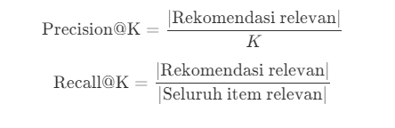

#### Insight:

Hasil evaluasi menunjukkan bahwa model CBF belum memberikan rekomendasi yang relevan secara konsisten. Hal ini mungkin disebabkan oleh keterbatasan fitur konten yang digunakan (judul, penulis, penerbit) hasil dari filtering tadi serta tidak mempertimbangkan interaksi pengguna.

---

### Collaborative Filtering

menggunakan pendekatan neural network (`RecommenderNet`) untuk mempelajari pola interaksi antara pengguna dan item berdasarkan data rating.

Model ini dievaluasi menggunakan metrik Mean Squared Error (MSE) dan Root Mean Squared Error (RMSE).

**Hasil Evaluasi:**

| Metrik | Nilai pada Data Training | Nilai pada Data Validasi |
| ------ | ------------------------ | ------------------------ |
| MSE    | 0.001993                 | 0.032780                 |
| RMSE   | 0.044639                 | 0.181052                 |

#### Rumus Evaluasi:

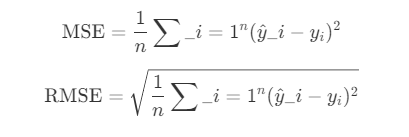

#### Insight:

Nilai RMSE yang rendah pada data latih menunjukkan bahwa model mampu mempelajari pola rating dengan baik. Performa pada data validasi masih cukup baik, menunjukkan bahwa model tidak overfitting. CF bekerja lebih baik dibandingkan CBF karena memanfaatkan data interaksi pengguna-buku secara langsung.

### Visualisasi Loss Training dan Validation

Visualisasi loss selama training dan validasi dapat digunakan untuk memantau apakah model mengalami overfitting atau underfitting. Penurunan loss yang stabil dan tidak terlalu berbeda antara training dan validation menandakan model yang baik.

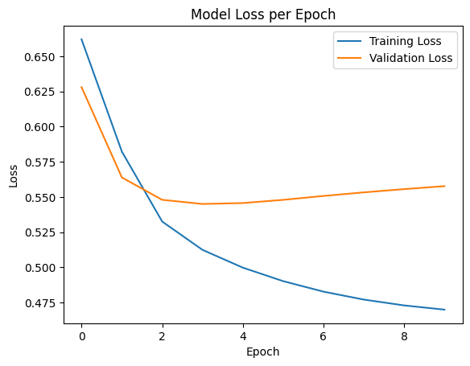
Visualisasi model Loss pada train dan validasi

### **Kesimpulan Evaluasi**

- Collaborative Filtering lebih unggul dalam akurasi prediksi dan kualitas rekomendasi.
- Content-Based Filtering memberikan baseline sederhana, namun masih kurang relevan karena keterbatasan fitur.
- Kombinasi keduanya melalui Hybrid Recommender System dapat menjadi solusi untuk meningkatkan performa sistem rekomendasi

---

## **Referensi**

- UNESCO. (2016). Literacy towards Indonesia's generation nowadays. Retrieved from https://www.researchgate.net/publication/346378989_Literacy_towards_Indonesia's_generation_nowadays

- Amazon Science. (2018). The history of Amazon's recommendation algorithmRetrieved from https://www.amazon.science/the-history-of-amazons-recommendation-algorithm
